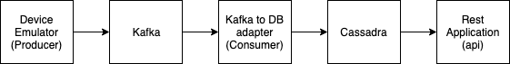

# Relay Assignment

## Context 
IoT devices send out continuous data which we want to collect (e.g thermostat, heart rate meter, car fuel readings, etc). 

Your task is to build a pipeline via which we can process the IoT data in a scalable manner. In addition to that, we want to have a secure web service for querying the readings (e.g average/median/max/min values) of specific sensors or groups of sensors for a specific timeframe.

# Implementation

## Stuff we use

- Java 8
- Spring Boot 2
- Maven 3.6
- Docker
- Docker Compose
- Kafka 2.1.1 + Zookeeper
- Cassandra 3.11

## Architecture

The pipeline is container based. 

Docker compose builds containers, run them and organizes network among them.



The pipeline contains 5 main sections.

**Producer**

Spring Boot based application packed into container. 
Imitates the set of devices. 
Sends random metrics for defined number of devices into kafka topic.  
 
**Kafka**

Message broker. Consists from 2 images:
- wurstmeister/zookeeper
- wurstmeister/kafka 

**Consumer**

Spring Boot based application packed into container.
Listens to kafka topic and puts data from the topic into database.

**Cassandra**

NoSQL data storage. Image: cassandra:3.11

**Api**

Spring Boot Web based application packed into container. 
Provides several endpoints for devices statistics.

## How to run

### Prerequisites

You need this project downloaded and ```docker-compose``` installed to run the pipeline successfully. 

### Compilation

The compilation is performed inside docker containers and doesn't require any java and maven installation. 
The result of compilation is repacked into execution containers to make them free of source code and build applications. 

### Run

You need to download the project and make its folder current.

Command to run docker compose:

```docker-compose up```

### Containers run order

Cassandra starts comparably long and other services can start earlier than db becomes acessible.
In this case ```consumer``` and ```api``` can fail their start-up.

### Endpoints

When you have the pipeline successfully run, api service forwards its container port for local usage.

Instead of ```<url>``` you should use ```localhost```. 
In case you're running docker machine you can get your url with command ```docker-machine ip```.

There are 2 endpoints provided by api service:
- Global statistics

Call ```GET http://<url>:8080/statistics/```

Response format:
```
{
    devices: [<device id list>],
    total_count: XXX
}
```
- Device statistics

Call ```GET http://<url>:8080/statistics/<device-id>?from=<from>&to=<to>```

Device id is UUID string. For example ```d9bf3fce-9d64-414b-8000-43bd4e65e946```.

Parameters ```from``` and ```to``` specify the time frame and are optional. If at least one parameter is missing, the second one is ignored. 
Date format is ```yyyy-MM-dd'T'HH:mm:ss.SSS'Z'```. For example ```2019-03-11T15:00:00.000Z```. 

Response format:
```
{
    device_id: <device-id>,
    from_date: <date>,
    to_date: <date>,
    count: <count>,
    min_value: <min>,
    max_value: <max>,
    avg_value: <avg>
}
```
# Demo

[](https://www.youtube.com/watch?v=WgO-rIT4IpE)

## Known issues

- I was unable to configure uuid serialization for kafka and i had to replace it with string. But i bet it's possible
- There were some difficulties with some data retrieving from cassandra: uuid and not mapped custom queries. That tricky code should be replaced with proper configuration. 
